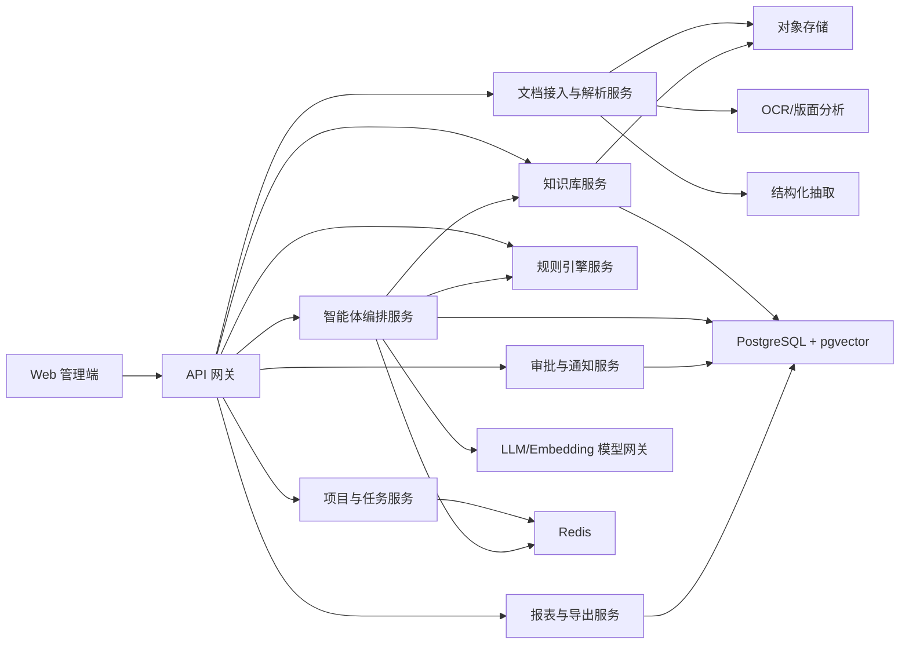

# 招投标智能体技术架构设计

## 1. 文档信息

- 文档名称：招投标智能体技术架构设计
- 版本：V1.0
- 日期：2026-03-18
- 关联文档：`docs/bid-agent-prd.md`
- 目标读者：技术负责人、后端工程师、AI 工程师、前端工程师、测试工程师、运维

## 2. 设计目标

本系统围绕以下三个业务模块建设：

1. 投标决策智能体
2. 标书生成智能体
3. 材料审核智能体

技术设计目标如下：

- 支持招标文件、合同、资质、证明材料的统一接入和解析
- 支持规则引擎、知识库和 AI 能力协同工作
- 支持可追溯、可解释、可审计的 AI 输出
- 支持低置信转人工和高风险审批
- 支持从 MVP 平滑演进到多组织、多模板、多业务线版本

## 3. 架构原则

- 规则优先：硬门槛、一票否决、有效期、一致性校验由规则引擎主导
- 检索优先：AI 生成前必须先检索企业知识库，减少幻觉
- 可追溯：所有 AI 输出保留输入范围、引用材料、模型版本和置信度
- 人机协同：高风险结论不直接放行，必须进入人工审核
- 模块解耦：文档解析、知识检索、规则中心、智能体编排、审批流独立服务化
- 渐进增强：MVP 先做单租户、单业务线，后续扩展多租户和行业模板

## 4. 总体架构

MVP 建议优先采用轻量化集成方案：

- `PostgreSQL` 作为唯一主业务库
- `pgvector` 作为 PostgreSQL 内的向量检索扩展
- `对象存储` 保存原始文件、导出文件和版本快照
- `Redis` 负责缓存、任务队列和短时状态

这样可以在不引入过多基础设施的前提下，同时覆盖结构化数据、语义检索、文件管理和异步任务四类核心能力。



## 5. 系统分层

### 5.1 接入层

负责前端页面、API 网关、身份认证、权限校验和导出下载。

建议组成：

- Web 管理端
- 后台 API 网关
- 登录认证与 RBAC
- 文件上传网关

### 5.2 业务服务层

负责项目流转、任务状态、审批、报表、导出和各模块业务编排。

建议拆分为：

- 项目服务
- 文档服务
- 决策服务
- 生成服务
- 审核服务
- 审批服务
- 报表服务

### 5.3 AI 中台层

负责非结构化理解、检索、生成、审核和 AI 任务调度。

建议拆分为：

- 模型网关
- Prompt 模板中心
- 智能体编排服务
- 检索与重排序服务
- AI 执行追踪服务

### 5.4 数据层

负责结构化数据、文档原件、向量索引、日志和审计数据存储。

建议组成：

- PostgreSQL：主业务库，承载项目、任务、审批、规则、抽取结果、风险问题
- pgvector：运行在 PostgreSQL 内部，承载知识库向量检索
- 对象存储：原始文件、导出文件、版本文件
- Redis：缓存、任务队列、幂等控制、临时任务状态
- 日志/监控存储：指标、链路、错误日志

MVP 阶段不强制引入独立的全文检索引擎和独立向量数据库，优先降低部署复杂度和运维成本。

## 6. 核心服务设计

### 6.1 项目与任务服务

职责：

- 项目创建、状态流转、成员分配
- 关联招标文件、生成稿、审核报告
- 管理任务节点与执行历史

关键状态建议：

- 草稿
- 待解析
- 待决策
- 决策中
- 已立项
- 生成中
- 审核中
- 待修订
- 待提交
- 已归档

### 6.2 文档接入与解析服务

职责：

- 文件上传与版本记录
- OCR 识别
- 版面分析
- 目录还原
- 表格提取
- 字段抽取
- 抽取置信度管理

处理流程：

1. 文件上传到对象存储
2. 生成文档任务
3. 判断文件类型与是否需要 OCR
4. 执行版面分析和结构还原
5. 提取文本块、表格、页码、段落锚点
6. 运行字段抽取
7. 保存结构化结果与置信度
8. 低置信字段进入人工校正

### 6.3 知识库服务

职责：

- 资料分类管理
- 标签和元数据维护
- 有效期管理
- 检索和重排序
- 引用来源追溯

知识资产分类建议：

- 企业信息
- 产品资料
- 解决方案
- 案例材料
- 资质证照
- 合同红线
- 投标模板
- 历史项目材料

检索机制建议：

- 第一步：关键词检索
- 第二步：向量召回
- 第三步：重排序
- 第四步：过滤失效材料与过期材料

MVP 阶段可优先采用 PostgreSQL 全文检索 + pgvector 的混合方案，无需单独引入 Elasticsearch/OpenSearch。

### 6.4 规则引擎服务

职责：

- 一票否决规则执行
- 决策评分规则执行
- 材料完整性规则执行
- 一致性校验规则执行
- 合同红线规则执行
- 风险等级计算

规则类型建议：

- 布尔规则：满足/不满足
- 区间规则：金额、期限、比例
- 集合规则：行业、区域、资质清单
- 组合规则：多条件联合命中
- 优先级规则：P0/P1/P2/P3 风险映射

### 6.5 智能体编排服务

职责：

- 接收业务任务并选择执行链路
- 调用解析结果、知识库和规则引擎
- 组织提示词、上下文和检索材料
- 调用模型完成分析、生成和审核
- 写入 AITrace 和记日志

建议包含三个业务 Agent：

- Decision Agent：负责决策说明、语义匹配和待确认项识别
- Generation Agent：负责章节规划、内容生成、自检和待确认项标注
- Review Agent：负责条款语义理解、冲突识别和风险归因

此外保留两个通用能力组件：

- Retrieval Worker：负责检索与重排序
- Guardrail Worker：负责引用校验、长度控制、敏感输出拦截

### 6.6 审批与通知服务

职责：

- 决策结论审批
- 高风险问题审批
- 风险豁免记录
- 低置信结果回流
- 通知与催办

通知方式建议：

- 邮件
- 飞书

## 7. 三大模块执行链路

### 7.1 投标决策链路

```text
上传招标文件
-> 文档解析
-> 关键信息抽取
-> 规则引擎执行一票否决
-> 检索企业资质/产品/案例
-> AI 做语义匹配分析
-> 评分引擎计算综合分
-> AI 生成可解释决策报告
-> 人工确认
```

系统边界：

- 是否满足硬门槛由规则判定
- AI 只负责匹配解释、风险摘要和待确认项
- 最终决策状态由人工确认写回

### 7.2 标书生成链路

```text
解析招标要求
-> 提取章节和评分项
-> 选择模板
-> 检索企业知识资产
-> 按章节生成初稿
-> 引用校验
-> AI 自检
-> 人工编辑
-> 生成正式版本
```

系统边界：

- 生成前必须检索
- 无引用内容标记为待确认
- 报价、法务承诺、交付承诺不自动终稿

### 7.3 材料审核链路

```text
上传材料包
-> 提取字段与元数据
-> 完整性规则检查
-> 一致性规则检查
-> 有效期规则检查
-> AI 语义审核合同和证明关系
-> 风险分级
-> 人工复核/豁免
-> 输出审核报告
```

系统边界：

- 字段级问题由规则先判
- AI 补充条款风险、语义冲突和支撑关系
- P0 风险阻断提交

## 8. AI 能力落点

### 8.1 文档理解

应用位置：

- 招标文件结构化
- 合同条款分段
- 表格与附件识别
- 关键字段抽取

输入：

- 原始文件
- OCR 结果
- 版面块和页码信息

输出：

- 章节树
- 段落锚点
- 结构化字段
- 字段置信度

### 8.2 语义检索

应用位置：

- 决策阶段匹配资质、案例和产品能力
- 生成阶段召回资料
- 审核阶段匹配合同红线和招标要求

输入：

- 用户任务
- 招标条款或生成章节
- 知识库候选材料

输出：

- Top-K 材料
- 相关度分
- 可引用片段

### 8.3 内容生成

应用位置：

- 决策说明
- 技术标章节
- 商务基础章节
- 风险摘要

约束要求：

- 默认先检索后生成
- 输出必须带引用来源
- 缺失信息必须标记待确认

### 8.4 语义审核

应用位置：

- 合同条款风险说明
- 跨文档语义冲突
- 材料支撑关系判断
- 章节覆盖度检查

输出要求：

- 风险等级建议
- 风险原因
- 命中依据
- 建议处理方式

## 9. 模型与推理架构

### 9.1 模型网关

模型调用统一走模型网关，避免业务服务直接调用外部模型。

网关职责：

- 模型路由
- 鉴权与限流
- 提示词模板注入
- 输出格式校验
- 重试和超时处理
- 成本统计

### 9.2 模型能力分配建议

- OCR/版面分析模型：用于扫描件、表格和文档结构识别
- Embedding 模型：用于知识库向量化和语义检索
- 通用大模型：用于抽取、解释、生成、自检和语义审核
- 可选轻量分类模型：用于文档分类、风险初筛

### 9.3 Prompt 设计原则

- 任务模板化：每类任务独立 prompt 模板
- 结构化输出：统一 JSON Schema 或固定字段输出
- 上下文最小化：只喂必要片段，控制成本和噪声
- 显式禁止编造：对事实性内容设置硬性约束
- 引用优先：输出需返回引用片段 ID 或材料 ID

## 10. 数据架构

### 10.1 存储建议

推荐采用轻量化四件套：

- PostgreSQL
  - 作为唯一主业务库
  - 存储项目、任务、规则、审批、字段抽取结果、风险问题、AITrace
  - 使用 JSONB 存储部分半结构化抽取结果和 AI 输出
- pgvector
  - 作为 PostgreSQL 扩展
  - 存储知识资产切片向量、召回索引和相似度检索结果
- 对象存储
  - 存储原始文件、解析中间件、导出文件、版本快照
- Redis
  - 存储异步任务状态、缓存热点数据、任务队列和分布式锁

该方案的优势：

- 基础设施少，部署简单
- 关系数据和向量数据可共用一套主库体系
- 适合中小规模知识库和 MVP 阶段快速迭代
- 方便后续平滑升级到独立检索组件

不建议在 MVP 初期同时引入 MySQL/MongoDB/Elasticsearch/独立向量库等多套存储，避免系统复杂度失控。

### 10.2 轻量方案与备选数据库取舍

#### 方案 A：PostgreSQL + pgvector + 对象存储 + Redis

适用阶段：

- MVP
- 单业务线
- 中小规模知识库

优点：

- 部署和运维成本最低
- 一套数据库即可覆盖大部分需求
- 数据一致性和事务处理能力强
- 非常适合审批流、规则引擎和统计报表

限制：

- 当知识库规模非常大时，向量检索和全文检索能力可能需要进一步拆分

#### 方案 B：PostgreSQL + Qdrant + 对象存储 + Redis

适用阶段：

- 知识库规模明显增大
- 召回性能和可扩展性要求提升

优点：

- 向量检索能力更专注
- 检索性能和运维边界更清晰

限制：

- 增加一套基础设施
- 数据同步链路更复杂

#### 方案 C：PostgreSQL + OpenSearch + pgvector + 对象存储 + Redis

适用阶段：

- 全文检索、复杂筛选、日志检索需求显著增加

优点：

- 适合做全文搜索、关键词搜索、复杂聚合和搜索运营

限制：

- MVP 阶段通常偏重
- 增加运维和数据同步成本

#### 方案 D：MongoDB 作为补充存储

适用阶段：

- 半结构化文档结果变化特别频繁
- 需要快速存储复杂 JSON 文档快照

建议定位：

- 仅作为补充存储
- 不建议替代 PostgreSQL 成为主业务库

原因：

- 审批流、规则命中、复杂关联查询、统计报表更适合关系数据库

### 10.3 核心表建议

- `projects`
- `project_members`
- `documents`
- `document_versions`
- `document_blocks`
- `extracted_fields`
- `knowledge_assets`
- `knowledge_chunks`
- `templates`
- `decision_reports`
- `decision_scores`
- `generated_documents`
- `generated_sections`
- `review_tasks`
- `risk_issues`
- `rules`
- `rule_hits`
- `approval_records`
- `ai_traces`

### 10.4 关键关系

- 一个 `project` 可关联多个 `documents`
- 一个 `document` 可对应多个 `document_blocks`
- 一个 `knowledge_asset` 可拆分多个 `knowledge_chunks`
- 一个 `decision_report` 对应多条 `decision_scores`
- 一个 `review_task` 对应多条 `risk_issues`
- 一个业务任务可对应多条 `ai_traces`

## 11. 接口设计建议

### 11.1 业务 API

- `POST /projects`
- `GET /projects/:id`
- `POST /projects/:id/documents`
- `POST /projects/:id/decision/run`
- `POST /projects/:id/generation/run`
- `POST /projects/:id/review/run`
- `POST /projects/:id/approve`
- `GET /projects/:id/reports`

### 11.2 知识库 API

- `POST /knowledge/assets`
- `GET /knowledge/assets`
- `POST /knowledge/retrieval/test`
- `POST /knowledge/reindex`

### 11.3 规则 API

- `POST /rules`
- `GET /rules`
- `POST /rules/validate`
- `GET /rules/hits`

### 11.4 AI 中台 API

- `POST /ai/extract`
- `POST /ai/retrieve`
- `POST /ai/generate`
- `POST /ai/review`
- `GET /ai/traces/:id`

## 12. 工作流设计

### 12.1 同步与异步边界

同步适合：

- 项目创建
- 页面查询
- 小规模字段校正

异步适合：

- OCR 和版面分析
- 大文档抽取
- 决策报告生成
- 标书批量生成
- 审核任务执行
- 向量重建

### 12.2 队列与任务建议

建议引入基于 Redis 的轻量任务队列，至少包含以下任务类型：

- `document_parse`
- `field_extract`
- `decision_run`
- `generation_run`
- `review_run`
- `knowledge_embed`
- `export_report`

状态流转建议：

- pending
- running
- succeeded
- failed
- waiting_human

## 13. 权限与安全设计

### 13.1 角色建议

- 超级管理员
- 投标专员
- 售前顾问
- 法务审核员
- 销售负责人
- 只读审计员

### 13.2 权限范围

- 项目级查看权限
- 文档级下载权限
- 知识库维护权限
- 规则编辑权限
- 审批权限
- 模型配置权限

### 13.3 安全控制

- 文件上传类型校验
- 敏感文件访问鉴权
- 导出文件水印
- 审计日志不可篡改
- 外部模型调用脱敏
- 关键字段加密存储

## 14. 可观测性与评估

### 14.1 监控指标

- 文档解析成功率
- 字段抽取准确率
- 知识检索命中率
- AI 输出引用覆盖率
- 任务平均耗时
- 审批退回率
- P0/P1 风险命中率

### 14.2 日志追踪

每次 AI 任务至少记录：

- 任务类型
- 输入文档 ID
- 检索材料 ID
- Prompt 版本
- 模型版本
- 输出摘要
- 置信度
- 错误码
- 执行时长

### 14.3 评估机制

- 离线评测：抽取、检索、生成、自检、审核五类任务分别建测试集
- 在线评测：统计采纳率、退回率、修订率
- 周期复盘：新增误判案例回灌到规则和知识库

## 15. 部署建议

### 15.1 MVP 部署

建议采用单环境部署：

- Web 前端
- 单体后端或轻量微服务
- PostgreSQL + pgvector
- 对象存储
- Redis/队列
- 模型网关

这套部署适合 1 个研发团队快速启动，并能覆盖：

- 业务主数据
- 语义检索
- 文件存储
- 异步任务
- AI 调用治理

### 15.2 演进路径

- 阶段一：单体业务服务 + AI 中台
- 阶段二：文档解析、知识库、智能体编排拆服务
- 阶段三：按需要引入 Qdrant 或 OpenSearch，支持多租户、多模型路由和更细粒度审计

## 16. 技术选型建议

### 16.1 后端

- 语言：Java / Go / Python 三选一，以团队熟悉度为准
- 框架：Spring Boot、FastAPI、Gin 等
- 队列：Redis Queue、RabbitMQ 或 Kafka

### 16.2 前端

- React + TypeScript
- 组件库按团队现有技术栈选型
- 文档预览需支持 PDF 和 Office 转预览

### 16.3 AI 相关

- 文档解析：OCR + 文档结构识别服务
- Embedding：统一向量模型
- LLM：统一模型网关接入
- Prompt 管理：数据库或配置中心版本化

### 16.4 数据库与存储选型建议

- 主库首选：PostgreSQL
- 向量检索首选：pgvector
- 文件存储首选：MinIO 或 S3 兼容对象存储
- 缓存与队列首选：Redis

备选建议：

- 当知识库规模扩大时再引入 Qdrant
- 当全文搜索与聚合需求变重时再引入 OpenSearch
- 除非有明确半结构化快照场景，否则不优先引入 MongoDB

## 17. MVP 实施建议

### 17.1 第一批必须打通

- 文档上传、解析、字段抽取
- 知识库上传与检索
- 一票否决规则
- 决策评分与报告
- 技术标基础生成
- 材料完整性/一致性/有效期审核

### 17.2 第二批增强

- 条款语义风险审核
- 章节级引用展示
- 审批流
- AI 自检
- 导出模板优化

## 18. 技术风险

- OCR 和版面分析质量不足会直接影响下游全部能力
- 企业知识库维护不到位会导致生成质量不稳定
- Prompt 和规则若不版本化，后续问题难追溯
- 语义审核若无人工闭环，误报和漏报会积累
- 外部模型成本和时延需要通过缓存、分层模型和异步任务控制

## 19. 研发拆分建议

### 19.1 后端

- 项目与任务服务
- 文档解析服务
- 知识库服务
- 规则引擎服务
- 审批与导出服务

### 19.2 AI

- 抽取链路
- 检索链路
- 生成链路
- 审核链路
- AITrace 与评估链路

### 19.3 前端

- 项目台账
- 文档解析校正页
- 决策评分卡页
- 标书生成工作台
- 审核风险工作台
- 知识库与规则管理页
